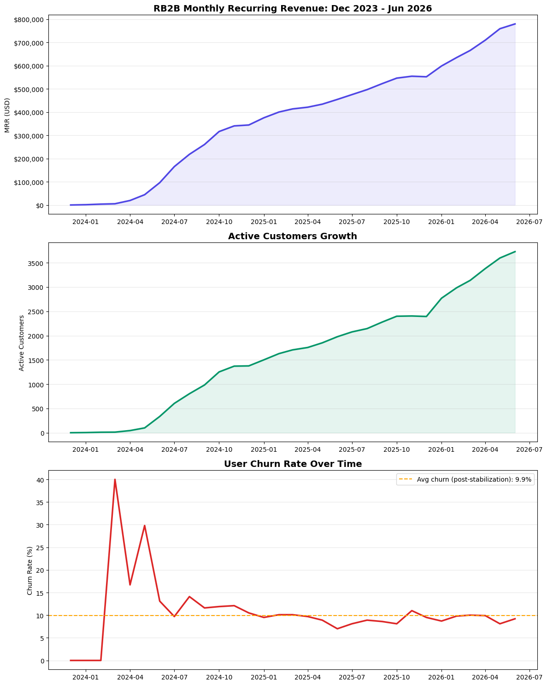
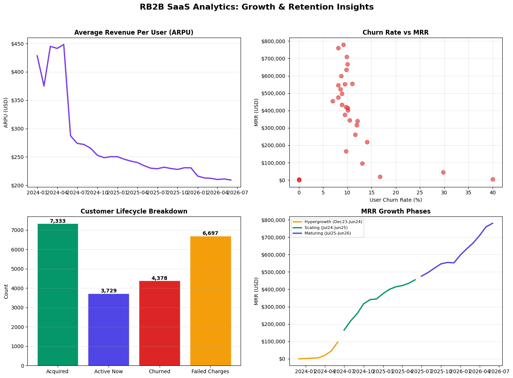

# RB2B SaaS Growth & Retention Analysis

**Tools:** Python, Pandas, Matplotlib  
**Data:** Baremetrics Open Startups (public dashboard)  
**Period:** December 2023 to June 2026

---

## The Question This Project Answers

RB2B grew from $0 to $780,000 MRR in 30 months. That is an extraordinary 
number. But growth metrics alone do not tell you whether a business is healthy. 
This project digs into what is happening underneath the revenue line.

---

## What I Found

**1. Growth is real but retention is the hidden story**

RB2B acquired 7,333 customers since launch. Only 3,729 are active today. 
That means more than 4,378 customers left. For every customer paying right 
now, there is another one who already churned.

**2. Failed charges are a bigger problem than churn**

6,697 payments failed over the same period. That number exceeds the entire 
current active customer base. Every failed charge is revenue that was earned 
but never collected. This is a dunning problem, not a product problem.

**3. Early churn was brutal, then the product found its footing**

In the first six months, monthly churn averaged 14.2%. By mid-2024 it 
stabilized around 9.8% and has held there. That pattern tells a clear story: 
early customers were not the right fit, but RB2B found their real audience.

**4. ARPU has been cut in half**

Average revenue per user dropped from $450 in early 2024 to $209 today. 
RB2B traded higher revenue per customer for faster volume growth. Whether 
that was the right tradeoff depends on lifetime value data not yet public.

**5. Three distinct growth phases**

- Hypergrowth (Dec 2023 to Jun 2024): $0 to $96k MRR in 6 months
- Scaling (Jul 2024 to Jun 2025): steady climb to $454k MRR
- Maturing (Jul 2025 to Jun 2026): growth continues but rate is slowing

---

## Visualizations

### Overview: MRR, Customers, and Churn Over Time

### Deep Dive: ARPU Decline, Customer Lifecycle, and Growth Phases

---

## Why This Project Exists

Baremetrics is a subscription analytics platform. Their Open Startups program 
lets companies share their metrics publicly. This project was built to 
demonstrate what a skilled analyst can surface from data that everyone can 
see but most people do not interrogate.

The Baremetrics dashboard shows you numbers. This analysis shows you what 
those numbers mean.

---

## Data Collection

All monthly data was manually recorded from RB2B's public Baremetrics 
dashboard at rb2b.baremetrics.com. Totals (total customers acquired, churned, 
failed charges) were taken directly from dashboard summary figures. Monthly 
granular values were read from chart tooltips.

No scraping. No private data. Everything here is publicly visible.

---

## About

Built by Aiman Ishaq, a data analyst focused on turning business data into 
decisions.
